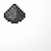
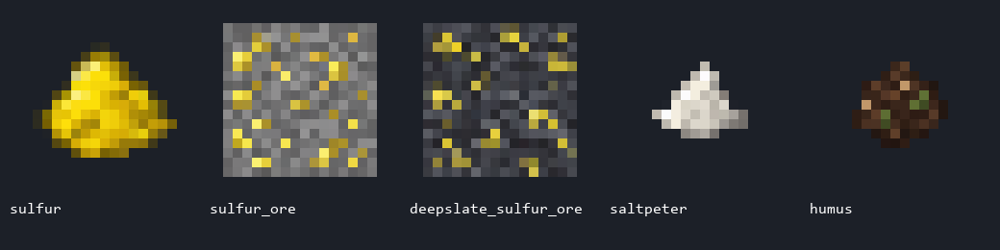

  

<h1 align="center">Craftable Gunpowder</h1>

Сера из шахт. Селитра из компостницы. Порох на верстаке.

  
  
  

<a href="README.md">English</a> · <b>Русский</b> · <a href="https://github.com/iwosw/craftable-gunpowder/releases">Скачать</a> · <a href="https://github.com/iwosw/craftable-gunpowder/issues">Сообщить об ошибке</a>

Небольшой мод для Minecraft Java, который добавляет альтернативный способ получения пороха через добычу ресурсов и переработку перегноя. Автор — **iwoss**.

**1 сера + 1 селитра + 1 древесный уголь → 8 пороха.** Обычный уголь не подходит.

## Возможности

- Серная руда и её глубинная разновидность.
- Сера, селитра и перегной с собственными текстурами 16×16.
- Переработка перегноя в обычной компостнице: **25% шанс получить селитру**.
- Рецепты перегноя и пороха на верстаке, с открытием в книге рецептов.
- Поддержка «Удачи» и «Шёлкового касания» для руды.
- Русские и английские названия предметов.
- Отдельные сборки для Fabric, Forge и NeoForge.

## Установка

1. Выбери версию Minecraft и установи подходящий загрузчик из таблицы ниже.
2. Открой [Releases](https://github.com/iwosw/craftable-gunpowder/releases) и скачай **один** JAR для точной пары версия/загрузчик.
3. Положи JAR в папку `mods`.
4. Для **Fabric** установи также **Fabric API** для своей версии Minecraft. Для Forge/NeoForge дополнительных модов не нужно.
5. Для сетевой игры установи мод **на сервер и у всех игроков**.

Пример имени: `craftable-gunpowder-1.21.1-neoforge-1.0.0.jar` — файл для Minecraft **1.21.1 / NeoForge**.

## Получение материалов

### Сера

Серная руда появляется в обычном мире, на высоте **Y −48…80**. Генератор делает 6 попыток разместить жилу на чанк, размер жилы — до 8 блоков. В камне появляется обычная руда, в глубинном сланце — глубинная.

- Нужна **каменная кирка или лучше**.
- Без зачарований один блок руды даёт **одну серу**.
- **«Удача»** увеличивает добычу.
- **«Шёлковое касание»** сохраняет сам блок руды.
- Руда появляется в **новых чанках**; уже исследованные участки мира не изменяются.

### Перегной ×4

Собери рецепт на верстаке:

| | | |
|---|---|---|
| Листва | Пшеница | Листва |
| Листва | Земля | Листва |
| Листва | Семена пшеницы | Листва |

Расход: **6 блоков листвы, 1 пшеница, 1 земля, 1 семя пшеницы**. Результат: **4 перегноя**. Подходит любая листва из тега `minecraft:leaves`, в том числе совместимая листва других модов.

### Селитра из компостницы

1. Поставь обычную **компостницу**.
2. Возьми перегной в руку и **нажми ПКМ по компостнице**.
3. Каждая попытка расходует **1 перегной**.
4. С шансом **25%** над компостницей появляется **1 селитра**. При неудаче перегной расходуется без выпадения предмета.

Каждая попытка независима: четыре перегноя дают в среднем одну селитру, но не гарантируют её. В творческом режиме перегной не расходуется.

Используй пустую или частично заполненную компостницу. Если она заполнена, дождись завершения обычного компостирования и забери костную муку. Специальная переработка перегноя не заполняет обычную шкалу компостницы и не меняет ванильное компостирование других предметов.

Селитра **не крафтится на верстаке**. Перегной нужно использовать предметом в руке: выбрасывание клавишей Q и загрузка через воронку не являются попыткой переработки.

## Порох ×8

Расположи три предмета **в один горизонтальный ряд** на верстаке:

| | | |
|---|---|---|
| Сера | Селитра | **Древесный уголь** |

Результат: **8 обычного пороха Minecraft**. Подходит любая строка верстака; зеркальный порядок тоже работает.

Нужен именно **древесный уголь** (`minecraft:charcoal`), полученный обжигом брёвен. Обычный уголь (`minecraft:coal`) не подходит. Рецепт занимает три клетки по ширине, поэтому сетка инвентаря 2×2 слишком мала. В версиях с ванильным автокрафтером рецепт также работает в нём.

## Поддерживаемые версии

**10 выпусков Minecraft, 24 отдельных JAR.** Это список точных поддерживаемых выпусков, а не непрерывный диапазон совместимости.

| Minecraft | Fabric | Forge | NeoForge | Java |
|---|:---:|:---:|:---:|:---:|
| 1.20.1 | ✓ | ✓ | ✓¹ | 17 |
| 1.20.4 | ✓ | ✓ | ✓ | 17 |
| 1.20.6 | ✓ | ✓ | ✓ | 21 |
| 1.21.1 | ✓ | ✓ | ✓ | 21 |
| 1.21.4 | ✓ | — | ✓ | 21 |
| 1.21.5 | ✓ | — | ✓ | 21 |
| 1.21.8 | ✓ | — | ✓ | 21 |
| 1.21.11 | ✓ | — | ✓ | 21 |
| 26.1 | ✓ | — | ✓² | 25 |
| 26.2 | ✓ | — | ✓ | 25 |

¹ NeoForge 1.20.1 использует раннюю ветку `net.neoforged:forge` с API Forge.

² Для точного выпуска Minecraft 26.1 используется NeoForge **26.1.0.19-beta**. Этот JAR не предназначен для 26.1.2.

Номера зависимостей закреплены в [versions.json](versions.json). Минимальные версии загрузчиков указаны внутри JAR; используй закреплённую версию или совместимую более новую для того же выпуска Minecraft.

## Частые вопросы

**Где найти предметы в творческом режиме?** Сера, селитра и перегной — во вкладке ингредиентов; руда — среди природных блоков.

**Почему порох не крафтится?** Проверь, что используешь древесный уголь и размещаешь все три ингредиента в одном горизонтальном ряду верстака.

**Почему не выпала селитра?** Шанс каждой попытки — 25%. Неудачи подряд возможны. Компостница также не должна быть полностью заполнена.

**Нужен новый мир?** Нет. Отправься в ещё не созданные чанки, чтобы найти руду.

**Можно ли положить мод в сборку?** Да, лицензия MIT разрешает распространение с сохранением лицензии и уведомления об авторстве.

**Конфликтует ли сера с Minecraft 26.2?** Предметы мода используют пространство имён `craftablegunpowder`; рецепт требует именно серу этого мода.

## Сборка и проверки

Инструкция для разработчиков — в [CONTRIBUTING.md](CONTRIBUTING.md). Проверки GitHub Actions собирают каждую пару версия/загрузчик и запускают отдельный сервер с тестовым миром. Проверяется переработка перегноя, расход предметов, выпадение селитры, добыча руды и перезагрузка ресурсов. В версиях от 1.21.1 автокрафтер дополнительно проверяет рецепты и отказ обычного угля.

Автоматические проверки не заменяют ручную проверку клиентского интерфейса и совместимости с конкретной сборкой модов.

[Отчёт 1.0.0: все 24 сборки и серверные проверки прошли успешно.](docs/VALIDATION.md)

## Авторство и лицензия

Мод: **iwoss**. Иконка предоставлена автором. Все пять текстур созданы для проекта с помощью встроенного ImageGen; [исходники и промпты](art/README.md) сохранены в репозитории.

[MIT License](LICENSE). Не является официальным продуктом Minecraft. Не одобрено Mojang или Microsoft и не связано с ними.
