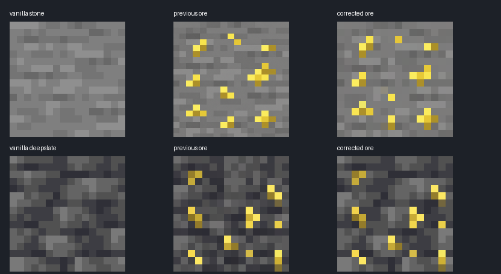

# Artwork

Five original textures were generated with the built-in **ImageGen** tool. The supplied icon is preserved as `icon.png`.

The original generated PNGs are in `source/`; the actual Minecraft textures are in `../shared/assets/craftablegunpowder/textures/`. `tools/import_art.py` performs only nearest-neighbour resizing to 16×16 RGBA, preserving generated transparency. It does not draw replacement artwork.

## Generation prompts

### Ore background correction (2026-09-20)

The stone ore was regenerated with the built-in ImageGen tool, using the vanilla Minecraft 1.21.1 `stone.png` as its background reference. The deepslate ore needed a stricter correction: its gray background now uses the vanilla 1.21.1 `deepslate.png` palette directly, with denser yellow mineral clusters composited from the generated source. Both final sources are exported by `tools/import_art.py` using nearest-neighbour resizing only.

The comparison below shows vanilla material, previous ore, and regenerated ore from left to right. On the final 16×16 exports, the mean background RGB (pixels with channel spread below 20) changed from `(115.9, 115.4, 116.1)` to `(121.8, 121.3, 120.7)` for stone, and from `(60.9, 61.9, 68.4)` to `(74.8, 74.4, 77.3)` for deepslate. Vanilla reference means are `(125.5, 125.5, 125.5)` and `(80.1, 80.1, 82.6)`. The regenerated palettes are closer, but not pixel-identical to vanilla. In-game lighting has not been manually verified.

Final stone edit prompt:

Use case: precise-object-edit. Asset type: Minecraft sulfur_ore.png block texture. Input image 1 is the authoritative vanilla stone background reference and edit base. Input image 2 is old sulfur ore, reference ONLY for golden-yellow mineral color. Produce one square opaque full-bleed tile. Preserve image 1 stone background colors, brightness and pixel pattern EXACTLY everywhere except sulfur flecks: neutral grayscale mean RGB 125,125,125, low contrast roughly 105 to 145. Overlay 8 to 10 small irregular lemon-yellow sulfur clusters occupying about 18 percent of tile. Each cluster 2-5 logical pixels, yellow highlights and ochre shading confined to mineral pixels. EXACT 16 by 16 logical grid enlarged to 1024x1024, every logical pixel a uniform 64x64 square. Do not darken the stone around minerals. No blue cast, black outlines, gradients, antialiasing, illumination, vignette, border, padding, labels, perspective or cube. Only one flat tile. Critical: background must blend into original Minecraft stone, no changed gray palette.

The deepslate source was finalized by vanilla-palette compositing after the edit prompt below produced an inconsistent gray field:

Use case: precise-object-edit. Asset type: Minecraft deepslate_sulfur_ore.png block texture. Input image 1 is authoritative vanilla deepslate background reference and edit base. Input image 2 is old sulfur ore, reference ONLY for yellow mineral appearance; its background is INCORRECT, too dark and blue. Produce one square opaque full-bleed tile. Preserve image 1 background brightness, palette and distinctive horizontal layered pattern EXACTLY everywhere except sulfur flecks: mean RGB about 80,80,83, main grays around #505052 and #606061, crevices around #303036. Overlay 8 to 10 small irregular lemon-yellow sulfur clusters, about 18 percent of tile, each 2-5 logical pixels, yellow highlights and ochre shading confined to mineral pixels. EXACT 16 by 16 logical grid enlarged to 1024x1024, every logical pixel uniform square. Gray background must look exactly like reference 1, NOT the blue-black old image 2. No added shadows surrounding minerals, no near-black random checkerboard, no gradients, no antialiasing, vignette, border, text, perspective or cube. Only one flat tile.

The prompts below document the original generation before this correction.

### Sulfur

#### 1.1.0 edge correction

Built-in ImageGen edit, saved to `art/source/sulfur.png` and exported to `shared/assets/craftablegunpowder/textures/item/sulfur.png`.

Prompt: Edit target: sulfur Minecraft inventory sprite. Preserve yellow powder pile silhouette and palette. Fix translucent fringes and clipped-looking edges. Crisp opaque pixel art on truly transparent background. Use a strict 16x16 logical pixel grid enlarged to 1024x1024 nearest-neighbor, flat square pixels. Keep mound centered, a complete natural stair-step boundary, at least 2 logical pixels padding on each side. Every subject pixel completely opaque alpha 255, every background pixel alpha 0. Absolutely no partial alpha, smooth gradients, thin fringes, antialiasing, detached pixels or glow. Restrained 5 color yellow/ochre palette, vanilla Minecraft appearance.

The mechanical item export now quantizes alpha to 0/255 after nearest-neighbor resizing and fits any edge-touching sprite inside a 14×14 area. Generated source images still contain near-opaque alpha; the exported game PNGs have a strict binary mask. Texture tests verify this and a transparent border. `tools/preview_textures.py` rebuilds the texture contact sheet.

Original prompt:

Use case: stylized-concept. Asset type: actual Minecraft mod inventory texture, sulfur item. Generate a single small bright golden-yellow sulfur mineral powder clump, recognizable angular chunky silhouette, rich yellow and ochre shading, flat front-facing Minecraft pixel art. Square canvas with a 16 by 16 pixel logical grid enlarged with exact hard square pixels, no antialiasing, limited 6-color palette. Centered item fills 12x12 logical pixels, with 2-pixel transparent padding. Actual transparent background. No text, no border, no UI, no shadow outside sprite, no other items. The output will be used directly as the mod's sulfur texture.

### Sulfur ore

Use case: stylized-concept. Asset type: Minecraft mod block face texture sulfur_ore.png. A single square seamless flat orthographic stone texture with scattered golden lemon-yellow sulfur flecks embedded in neutral gray stone. Authentic low resolution Minecraft pixel-art material, 16x16 logical square pixels enlarged sharply, limited muted gray and gold palette, about 25 percent yellow mineral. Texture fills entire canvas edge to edge, opaque. No perspective, no 3D cube, no border, no text, no UI, no lighting gradients, no margins. Only one tile.

### Saltpeter

#### 1.1.0 edge correction

Built-in ImageGen edit, saved to `art/source/saltpeter.png` and exported to `shared/assets/craftablegunpowder/textures/item/saltpeter.png` with the same binary-alpha export.

Prompt: Edit target: attached saltpeter Minecraft item sprite. Preserve its off-white and gray powder pile identity. Repair the silhouette: centered complete cohesive mound with clean stair-step pixel edges and at least 2 pixels transparent padding on every side in a logical 16x16 grid. Render precisely as a 16x16 pixel art sprite enlarged nearest-neighbor to 1024x1024; each logical pixel is a flat 64x64 square. Fully opaque solid colors for every subject pixel, fully transparent empty background. No semitransparent pixels, no feathering, no antialiasing, no glow, no detached specks, no thin fringes, no clipping. Restrained 5-color gray ivory palette. Crisp vanilla Minecraft inventory texture.

Original prompt:

Use case: stylized-concept. Asset type: Minecraft inventory texture saltpeter.png. Single small off-white saltpeter crystal dust heap, light ivory angular grains, cool pale gray shadow pixels, tiny white crystalline highlights. Flat front-facing authentic Minecraft pixel art, exactly 16 by 16 logical square pixels enlarged sharply, hard edges, limited 6-color palette. Compact asymmetrical pile fills 12x12 logical pixels centered, 2-pixel transparent padding. Actual transparent background. No text, no lettering, no border, no UI, no gradient, no separate shadow, only one item sprite.

### Humus

Use case: stylized-concept. Asset type: Minecraft inventory texture humus.png. Single small dark brown humus compost clump with three tiny muted olive-green plant flecks and tan organic speckles. Flat front-facing authentic Minecraft pixel art, 16 by 16 logical square pixels enlarged sharply, hard edges, limited six-color palette. Compact asymmetrical earthy clump fills 12x12 logical pixels centered with 2-pixel transparent padding. Actual transparent background. No text, no lettering, no border, no UI, no gradient, no separate shadow, only one item sprite.

### Deepslate sulfur ore

Use case: stylized-concept. Asset type: Minecraft mod block face texture deepslate_sulfur_ore.png. A single square seamless flat orthographic texture of dark charcoal-gray deepslate stone with scattered golden lemon-yellow sulfur mineral flecks. Recognizable subtle horizontal layered stone grain, authentic low resolution Minecraft pixel-art material, 16x16 logical square pixels enlarged sharply, limited dark gray and yellow palette, about 25 percent yellow mineral. Texture fills entire canvas edge to edge, opaque. No perspective, no 3D cube, no border, no text, no UI, no gradients, no margins. Only one tile.
